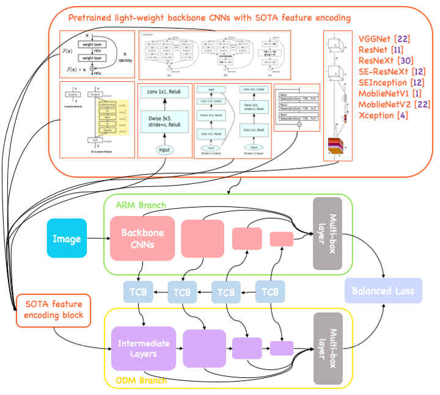
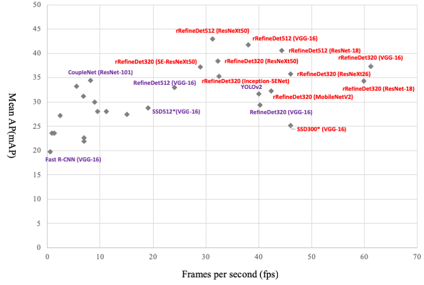

## Fast and accurate real-time convolutional object detectors for embedded plaforms

##### under review

### Abstract
###### With the improvements in the object detection networks, several variations of object detection networks have been achieved impressive performance. However, the performance evaluation of most models has focused on detection accuracy, and the performance verification is mostly based on high-end GPU hardwares. In this paper, we propose real-time object detectors that guarantees balanced performance for real-time system on embedded platforms. The proposed model utilizes the basic head structure of the RefineDet model, which is a variant of the single shot object detector (SSD). In order to ensure real-time performance, CNN models with relatively shallow layers or fewer parameters have been used as the backbone structure. In addition to the basic VGGNet and ResNet structures, various backbone structures such as MobileNet, Xception, ResNeXt, Inception-SENet, and SE-ResNeXt have been used for this purpose. Successful training of object detection networks was achieved through an appropriate combination of intermediate layers. The accuracy of the proposed detector was estimated by the evaluation of MS-COCO 2017 object detection dataset and the inference speed on the NVIDIA Drive PX2 and Jetson Xaviers boards were tested to verify real-time performance in the embedded systems. The experiments show that the proposed models ensure balanced performance in terms of accuracy and inference speed in the embedded system environments. In addition, unlike the high-end GPUs, the use of embedded GPUs involves several additional concerns for efficient inference, which have been identified in this work. The codes and models are publicly available on [the web (link)](https://github.com/mkchoi-0323/modified_refinedet/).

### Networks Overview

### 1. Installation
#### 1.1 Requirement
- Ubuntu 16.04
- Caffe
- Python2
- CUDA 9.0

#### 1.2 ReifineDet
- Install original RefineDet source from [git (link)](https://github.com/sfzhang15/RefineDet)  
  _git clone https://github.com/sfzhang15/RefineDet.git_
  
- Fllowing step to train and test with original RefineDet using COCO dataset [git (link)](http://cocodataset.org/#home)

#### 1.3 Rebuild for Modified RefineDet
- Download requirements from this repository  
  _git clone https://github.com/mkchoi-0323/modified_refinedet.git_

- Rebuild caffe for original RefineDet with new caffe layers (depthwise convolution and axpy laer)  
  _cd RefineDet_  
  _make clean_  
  1. copy every .cpp and .cu files in addtional_layers  
  2. paste .cpp and .cu files to original RefineDet/src/caffe/layers/  
  3. copy every .hpp files in additional_layers  
  4. paste .hpp files to original RefineDet/include/caffe/layers/  

- Rebuild by caffe compile command  
  _make all -j4_

### 2. Training
- Download desired python code to generate head and backbone  
  * For example, you should prepare **MobileNetV1_COCO_320.py** and **model_libs_MobileNetV1.py** to train new model of RefineDet with MobileNetV1 blocks

- Make model path and copy python trainin interface  
  _mkdir RefineDet/models/MobileNet/coco/refinedet_mobilenetv1_320x320_  
  _cp modified_refinedet/heads/MobileNetV1_COCO_320.py RefineDet/models/MobileNet/coco/refinedet_mobilenetv1_320x320/_

- Download pre-trained backbone ([link](https://drive.google.com/drive/folders/1yMk-NwEisESKt6c8emIvmi1SCYFI0VbJ?usp=sharing))

- Copy pre-trained backbone to model path  
  _cp modified_refinedet/pretrained_backbones/mobielnet.caffemodel RefineDet/models/MobileNet/_

- Copy model interface to original RefineDet  
  _mv RefineDet/python/caffe/model_libs.py RefineDet/python/caffe/model_libs.py.backup_   
  _cp modified_refinedet/heads/model_libs_MobileNetV1.py RefineDet/python/caffe/model_libs.py_  
  
- Run training interface  
  _cd RefineDet_  
  _python models/MobileNet/coco/refinedet_mobilenetv1_320x320/model_libs_MobileNetV1.py_  

### 3. Testing
- Copy dataset loader to original RefineDet interface  
  _mv RefineDet/test/lib/dataset/coco.py RefineDet/test/lib/dataset/coco.py.backup_  
  _mv RefineDet/test/lib/dataset/factory.py RefineDet/test/lib/dataset/factory.py.backup_  
  _mv modified_refinedet/test/lib/dataset/coco.py RefineDet/test/lib/dataset/_  
  _mv modified_refinedet/test/lib/dataset/factory.py RefineDet/test/lib/dataset/_  
  
- Copy testing interface  
  _mv modified_refinedet/test/lib/dataset/coco.py RefineDet/test/lib/dataset/_  
  _mv modified_refinedet/refinedet_test_MobileNet.py_  

- Download pre-trained models ([link](https://drive.google.com/open?id=1NrC9p4R-z4HmN29A13boo_srfgwfmLah))

- Set model and deploy path to proper location

#### 3.1 val2017
- Set model and deploy path to proper location  
  _vim modified_refinedet/test/refinedet_test_MobileNet.py_

- Run test  
  _cd RefineDet_  
  _python modified_refinedet/test/refinedet_test_MobileNet.py_

#### 3.2 test-dev2017
- Set model and deploy path to proper location  
  _vim modified_refinedet/test/refinedet_test-dev.py_
  
- Run test  
  _cd RefineDet_  
  _python modified_refinedet/test/refinedet_test-dev.py_
  
### Experiments
 

##### Accuracy (mAP) vs. Speed (fps) on MS-COCO dataset. Our models (red) and former models (purple)
